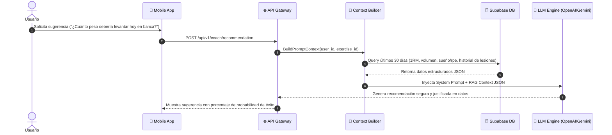

# AI Coach Runtime Architecture & Guardrails

## 1. Visión General del AI Coach

El **AI Virtual Coach** actúa como un acompañante inteligente de entrenamiento. No reemplaza a un profesional médico, sino que sintetiza los datos de entrenamiento históricos del usuario para ofrecer análisis de fatiga, recomendaciones de sobrecarga y frases motivacionales basadas en hechos objetivos.

---

## 2. Diagrama de Ensamblaje de Contexto (Context Builder)

---

## 3. Guardrails y Políticas de Seguridad

### **Reglas Estrictas del Sistema (Safety & Guardrails)**
1. **Política Médica & Lesiones:** Si el usuario menciona dolor agudo o punzante (ej. en articulación, hombro o espalda), el coach DEBE detener la sugerencia de peso e instruir inmediatamente a consultar a un médico o fisioterapeuta.
2. **Límite de Incrementos Seguros:** La recomendación de aumento de peso NUNCA superará el $5\%$ respecto a la marca máxima histórica registrada para ejercicios compuestos, ni el $2.5\%$ para aislados.
3. **Invariante de Explicabilidad:** Toda recomendación de carga DEBE ir acompañada de la evidencia objetiva que la respalda (ej. *"Basado en tus últimas 3 sesiones donde completaste 8 reps con 70kg..."*).
