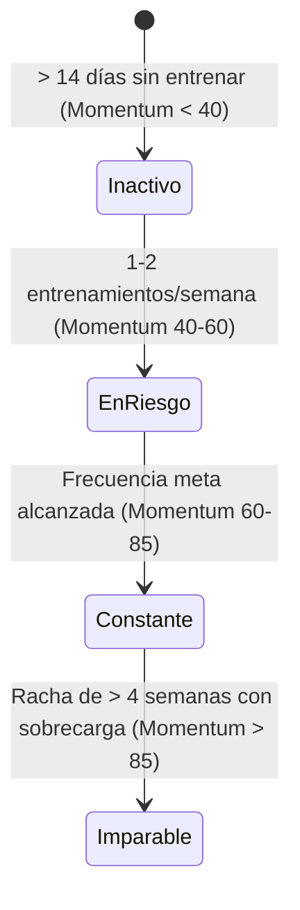

# Algoritmos de Progreso y Sobrecarga Progresiva

## 1. Detección de Sobrecarga Progresiva (Progressive Overload Engine)

El motor de progreso analiza la tendencia del usuario en una ventana deslizante de 28 días (4 semanas) para determinar si existe evidencia objetiva de mejora física.

### **Criterios de Sobrecarga Validados**
Para un ejercicio determinado $E$, se considera que existe **progreso positivo** en la sesión $S_t$ comparada con la mejor sesión $S_{prev}$ del último mes si se cumple al menos una de las siguientes condiciones:

1. **Incremento de Carga Directa:**
   \[
   1RM(S_t) > 1RM(S_{prev}) \times 1.015 \quad (+1.5\% \text{ en 1RM estimado})
   \]
2. **Incremento de Repeticiones con Misma Carga:**
   \[
   Peso(S_t) = Peso(S_{prev}) \land Reps(S_t) > Reps(S_{prev})
   \]
3. **Mayor Volumen Efectivo acumulado a igual o menor tiempo de descanso:**
   \[
   Volumen(S_t) > Volumen(S_{prev}) \times 1.05 \quad (+5\% \text{ en volumen por grupo muscular})
   \]

---

## 2. Índice de Momentum (Momentum Index)

El **Momentum Index ($M$)** es un indicador de $0$ a $100$ que mide la consistencia del atleta y la calidad de su frecuencia de entrenamiento.

### **Fórmula de Cálculo**
\[
M = (C \times 0.50) + (V_{trend} \times 0.30) + (R_{density} \times 0.20)
\]

* **$C$ (Constancia / Consistency Score):** Porcentaje de entrenamientos completados en relación a la meta semanal declarada por el usuario en el onboarding.
* **$V_{trend}$ (Tendencia de Volumen):** Comparativa del volumen total acumulado de las últimas 2 semanas vs. el promedio histórico del mes.
* **$R_{density}$ (Densidad de Recuperación):** Factor que penaliza periodos de inactivdad superiores a 7 días en cualquier grupo muscular principal (Pecho, Espalda, Pierna).

