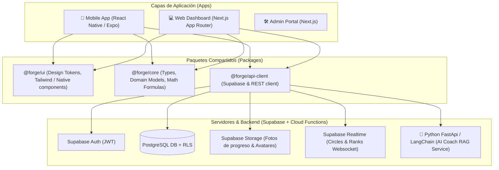

# Arquitectura de Plataforma — Forge

## 1. Visión General de la Arquitectura

Forge está diseñado como un **Monorepo moderno (Turborepo + pnpm)** estructurado en capas de dominio, aplicaciones de usuario y servicios desacoplados.

---

## 2. Componentes de la Plataforma

| Componente | Tecnología | Responsabilidad |
|------------|------------|-----------------|
| **`apps/mobile`** | React Native, Expo SDK 51+, React Navigation, Zustand / React Query | App nativa iOS y Android para atletas en gimnasio. Soporta almacenamiento local con AsyncStorage/WatermelonDB para resistencia a pérdida de señal. |
| **`apps/web`** | Next.js 14+ (App Router), TailwindCSS, Lucide Icons | Dashboard web responsivo para consulta analítica de progreso, gráficos de 1RM y administración de perfil. |
| **`apps/admin`** | Next.js, Shadcn UI | Panel interno para moderación de catálogo de ejercicios y telemetría de la app. |
| **`packages/core`** | TypeScript ESM/CJS | Lógica de negocio pura (cálculos de 1RM con Epley/Brzycki, cálculo de XP por serie, reglas de ascenso de rango, validador de invariantes). |
| **`packages/ui`** | React / React Native primitives | Sistema de diseño compartido, tokens de color, componentes interactivos de alto rendimiento. |
| **`backend`** | Supabase (PostgreSQL + PostgREST + Edge Functions) | Autenticación, persistencia transaccional con RLS, eventos en tiempo real para círculos sociales y almacenamiento multimedia. |
| **`ai-service`** | Python 3.11, FastAPI, LangChain, OpenAI / Gemini API | Microservicio independiente especializado en generación de contexto, guardrails de seguridad y motor de recomendación inteligente. |

---

## 3. Patrones de Diseño e Invariantes Tecnológicas

1. **API First & Offline Resilience:** Toda acción de escritura en entrenamiento se registra localmente antes de sincronizarse con Supabase.
2. **Domain-Driven Isolation:** Los algoritmos de progreso y gamificación viven independientemente del framework de UI dentro de `@forge/core`.
3. **Strict RLS:** Ningún cliente puede leer ni modificar datos de entrenamiento de otro usuario a menos que pertenezca explícitamente a su mismo *Circle* autorizado.
